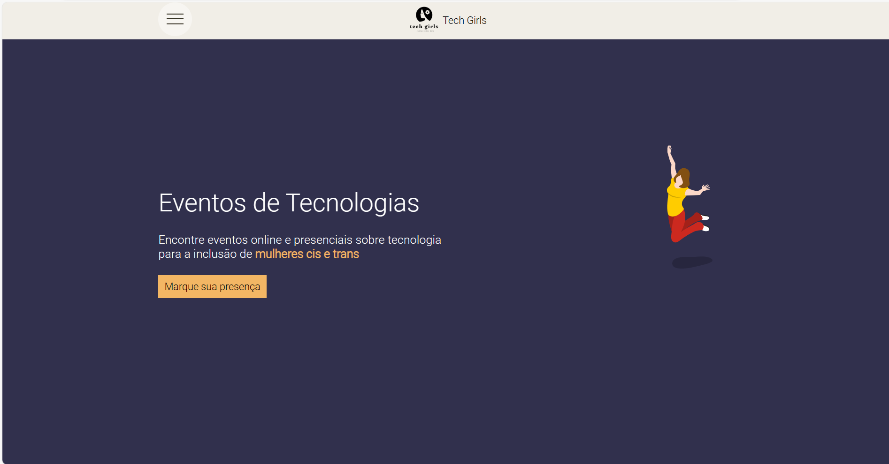
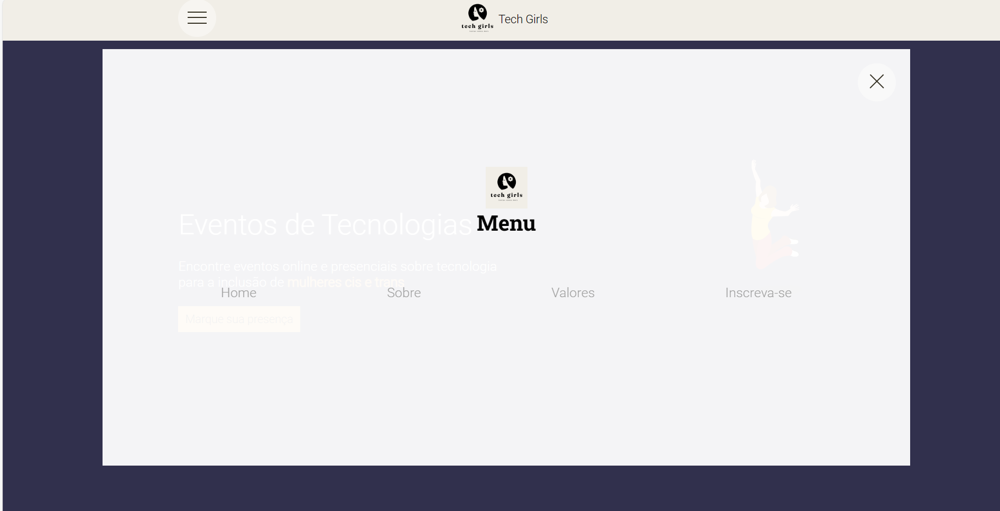
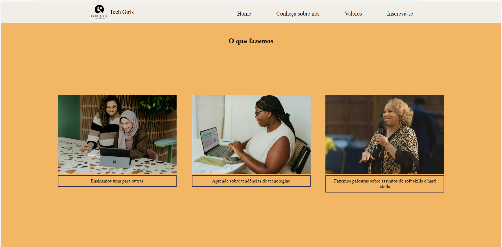
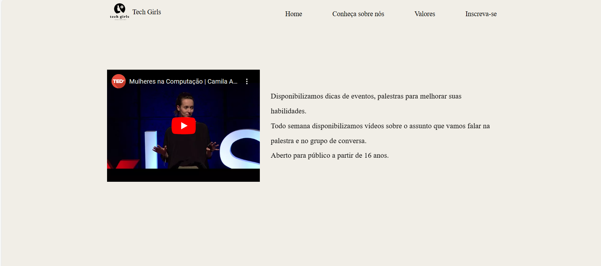
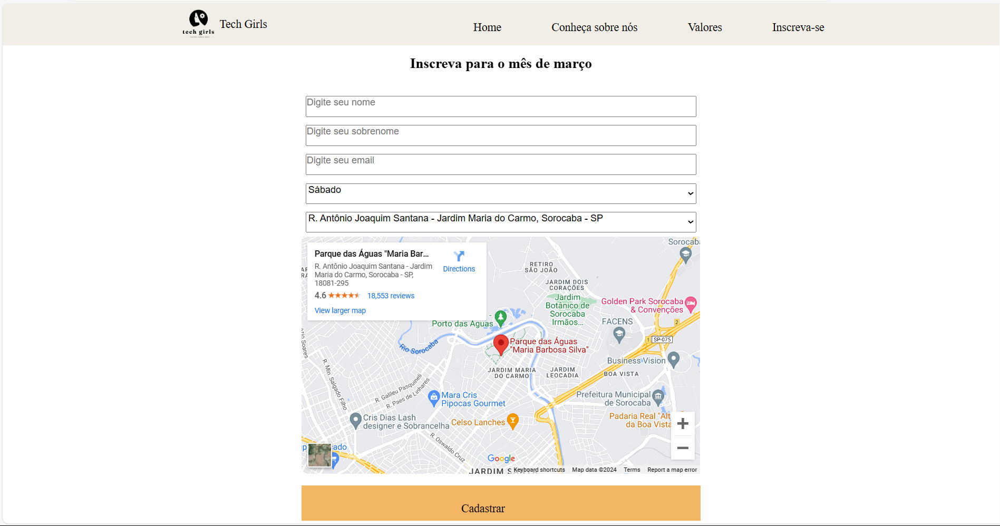
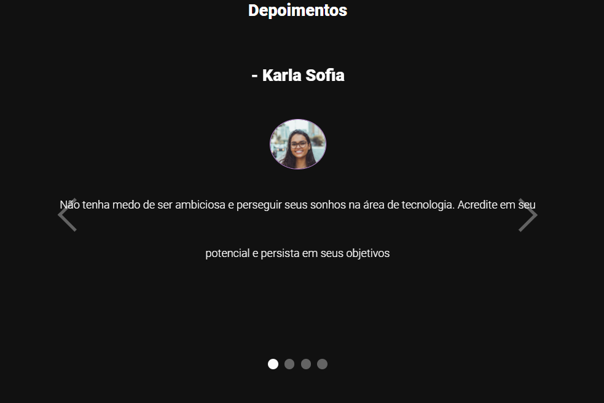

# <h1 align="center">  🔨 Desafio: Criar landing page</h1>

## 🏹 Objetivo
- Criar um landing page sobre tema de interesse (escolhi fazer site de divulgação de palestras gratuitas para mulheres)
 

## 🧩 Componentes das telas

| Componente  | Descrição | Imagem do Site |
| ------------- | ------------- | -------------|
| Logo  | <ul> <li> Criar Logo </li> </ul> |  |
| Homepage | <ul> <li> Título destacado sobre o assunto do site com imagem de fundo </li> <li> Trecho de texto com plano de fundo colorido  </li>  <li> Botão com link interno ou externo   </ul> |   |
| Menu | Menu responsivo |  |
| Seção | <ul> <li> Galeria com imagens com descrição (pelo menos 3 imagens) </li> </ul> |  |
| Vídeo | <ul> <li> Adicionar pelo menos um vídeo </li> </ul> |  |
| Mapa e formulário |  <ul> <li> Adicionar mapa de localização </li> <li> Formulário para coletar cadastro </li> </ul> | |
| Carousel | <ul> <li> Adicionar carousel </li> </ul> |  |
| Rodapé | <ul> <li> Rodapé com a frase criado por "seunome" - apenas para fins didáticos </li> </ul> |  |

 

## 👩🏻‍🏫 Desafio proposto por:
- <a href="https://descodificadas.com.br/" target="_blank">Descodificadas</a>

 

## 📽️ Deploy das Telas:
- <a href="https://angelica-shigematsu.github.io/desafio-landpage-descodificadas/" target="_blank">Landing page</a>

 

## 👩🏻‍💻 Desenvolvida por: 
- Angélica Shigematsu

